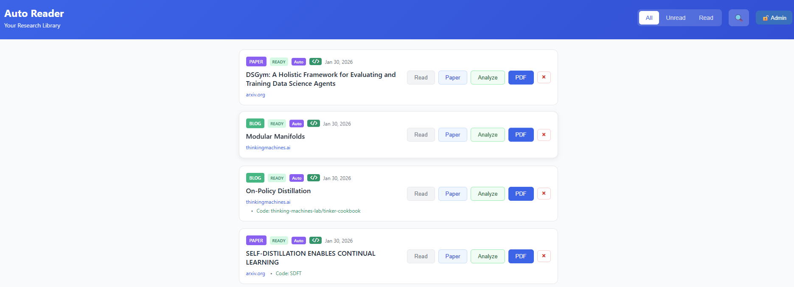
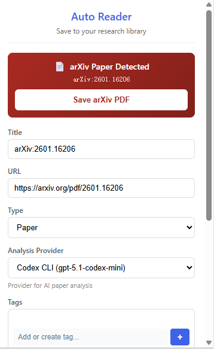

# Auto Reader 中文文档

[English](../README.md) | **中文文档**

## 截图

| 网页界面 | Chrome 扩展 |
|:---:|:---:|
|  |  |

## 功能特点

- **一键保存论文** - Chrome 扩展支持从 arXiv、OpenReview 等网站保存论文
- **AI 智能摘要** - 多轮深度阅读生成全面笔记
- **代码分析** - 自动分析关联的 GitHub 仓库
- **精美图表** - 自动生成 Mermaid 架构图和流程图
- **数学公式支持** - 使用 KaTeX 完整渲染 LaTeX
- **阅读追踪** - 标记论文已读/未读状态，筛选你的文库
- **全文搜索** - 按标题、标签和内容查找论文

## 快速开始

### 1. 克隆仓库

```bash
git clone https://github.com/CurryTang/auto-researcher.git
cd auto-researcher
```

### 2. 设置后端

```bash
cd backend
npm install
cp .env.example .env
# 编辑 .env 填入你的凭证（参见配置指南）
npm start
```

### 3. 设置前端

```bash
cd frontend
npm install
npm run dev
```

### 4. 安装 Chrome 扩展

1. 打开 Chrome 浏览器，访问 `chrome://extensions/`
2. 启用"开发者模式"
3. 点击"加载已解压的扩展程序"，选择 `extension/` 文件夹

## 工作原理

```
┌──────────────┐     ┌──────────────┐     ┌──────────────┐
│   浏览器      │────▶│   后端       │────▶│  Gemini AI   │
│   扩展       │     │   API        │     │   分析       │
└──────────────┘     └──────────────┘     └──────────────┘
       │                    │                    │
       │                    ▼                    │
       │             ┌──────────────┐            │
       │             │   数据库      │            │
       │             │   (Turso)    │            │
       │             └──────────────┘            │
       │                    │                    │
       ▼                    ▼                    ▼
┌──────────────────────────────────────────────────────┐
│                    网页界面                           │
│         查看论文、笔记、图表、代码                      │
└──────────────────────────────────────────────────────┘
```

### 论文处理流程

1. **保存** - Chrome 扩展捕获论文元数据和 PDF
2. **排队** - 论文加入处理队列
3. **分析** - Gemini AI 进行 3 轮深度阅读：
   - 第1轮：鸟瞰扫描（结构、关键页面）
   - 第2轮：内容理解（方法、结果）
   - 第3轮：深度分析（数学、图表）
4. **存储** - 笔记保存到云存储
5. **查看** - 精美渲染的笔记，包含图表和数学公式

## 文档

- [部署指南](DEPLOYMENT_CN.md) - 如何部署到生产环境
- [使用指南](USAGE_CN.md) - 如何使用应用
- [配置指南](CONFIGURATION_CN.md) - 所有配置选项
- [S3 设置指南](S3_SETUP_GUIDE.md) - AWS S3 配置

## 技术栈

**前端：**
- React 18
- Vite
- React Markdown + KaTeX + Mermaid
- GitHub Pages 托管

**后端：**
- Node.js + Express
- Turso (SQLite 云端)
- AWS S3
- PM2 进程管理

**AI：**
- Google Gemini CLI（论文分析）
- Claude Code CLI（代码分析）

## 配置

主要环境变量：

```bash
# 必需
TURSO_DATABASE_URL=libsql://你的数据库.turso.io
TURSO_AUTH_TOKEN=你的令牌
AWS_ACCESS_KEY_ID=你的密钥ID
AWS_SECRET_ACCESS_KEY=你的密钥
AWS_S3_BUCKET=你的存储桶

# 认证
ADMIN_TOKEN=你的管理员令牌  # 用于写操作

# 可选
READER_MAX_PER_HOUR=5        # 每小时处理论文数
RATE_LIMIT_MAX=200           # API 速率限制
```

详见[配置指南](CONFIGURATION_CN.md)。

## 开发

```bash
# 后端（支持热重载）
cd backend && npm run dev

# 前端（支持热重载）
cd frontend && npm run dev
```

## 部署

使用部署脚本快速部署：

```bash
./scripts/deploy.sh deploy
```

详见[部署指南](DEPLOYMENT_CN.md)。

## 更新

### 推荐部署架构

我们的 DigitalOcean 服务器是低配实例（$8/月），无法很好地应对多用户场景。推荐的部署方式是将云服务器作为**轻量代理**，然后使用 [FRP](https://github.com/fatedier/frp)（快速反向代理）将用户请求转发到本地高性能 PC 进行实际的 AI 处理。

```
┌──────────┐     ┌─────────────────────┐     ┌──────────────────────┐
│   用户    │────▶│  云服务器 ($8)       │────▶│  本地高性能 PC        │
│          │     │  (FRP 代理)          │     │  (AI 处理)           │
└──────────┘     └─────────────────────┘     └──────────────────────┘
```

这样，云服务器只处理路由和轻量 API 请求，而所有繁重的 AI 工作负载（Gemini CLI、Codex CLI、Claude Code）都在本地硬件更强的机器上运行。

## 贡献

欢迎贡献！请随时提交 Pull Request。

## 许可证

MIT 许可证 - 详见 [LICENSE](../LICENSE)。

## 致谢

- [Gemini](https://deepmind.google/technologies/gemini/) 提供论文分析
- [Mermaid](https://mermaid.js.org/) 提供图表渲染
- [KaTeX](https://katex.org/) 提供数学公式渲染
